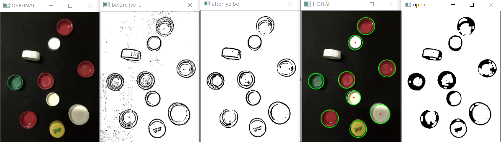
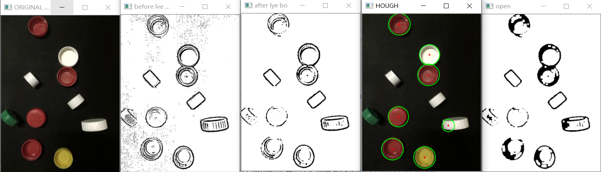
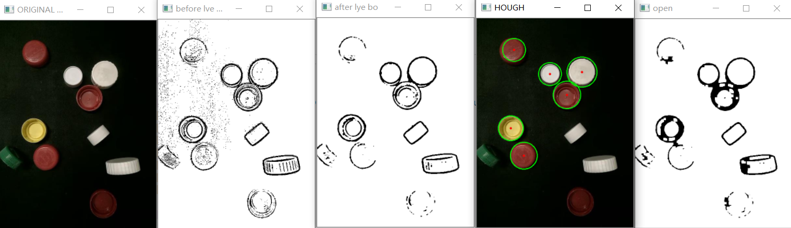

# Computer Vision Project Report

## 方案一：Naïve Image Operation

### 模板匹配

模板无法旋转、跳跃，不符合使用场景

### 聚类

相同颜色的不同姿态瓶盖会被分为同一类，我们很难根据单独OpenCV自带的库KMEANS对拍摄图片进行正确的分类

### HOUGH变换

流程

- 读取图片

- 灰度化

- 二值化 `cv2.adaptiveThreshold`

- 中值滤波 -> 拍摄条件不佳时，会有较多的噪声

- 霍夫变换 -> 检测圆形的存在，这一步会识别正面和反面。如果参数调整正确时，侧面的瓶盖很难在这一步被发现

- 开操作 -> 为了识别圆形瓶盖的正面和反面，通过观察我们发现开口向上的瓶盖螺纹在二维图像上面的显示较为明显，而开口向下的瓶盖螺纹显示较为稀疏。因此可以采用面积计数的方法判断我们检测出来的圆形是正面还是反面。但是，有些时候开口向上的螺纹显示虽然有，但是断断续续。因此，我们使用开操作来将螺纹的显示更为密集。

  TEST1： 从左至右依次为：原图，二值化，去噪，霍夫变换，开操作之后的图像。按照现行方法，估计会有一张图片识别错误，一张侧立图片无法识别。

  

  TEST2： 从左至右依次为：原图，二值化，去噪，霍夫变换，开操作之后的图像。按照现行方法，估计会有一张侧立图片识别错误，三张侧立图片无法识别。

  

  TEST3： 从左至右依次为：原图，二值化，去噪，霍夫变换，开操作之后的图像。按照现行方法，估计会有一张开口向上的图片无法识别，三张侧立图片无法识别。

  

> 阶段总结：
>
> 1. 算法基本没有问题；
>
> 2. 针对出现的两个开口方向向上以及向下识别错误，我们的改进：
>    - 需要思考一下，方面可以包含拍照的角度、光照（工程上的折中）；调整现在算法里面的参数，使得识别更为精准，尤其是针对将侧立图片被霍夫变换识别为圆的情况。
>
> 3. 未完成部分算法 -> 利用面积判断正反面。

- 下面一个难点：如何识别出侧立瓶盖的位置

  将聚类的思想应用到该问题上面来：先聚类，找出聚类的结果；如果某一类别集中在已经判断的部分，那么这个部分就不需要再判断是否为侧面。如果未能判断，那么接着判断侧面的中心位置。

## 方案二：Machine Learning

